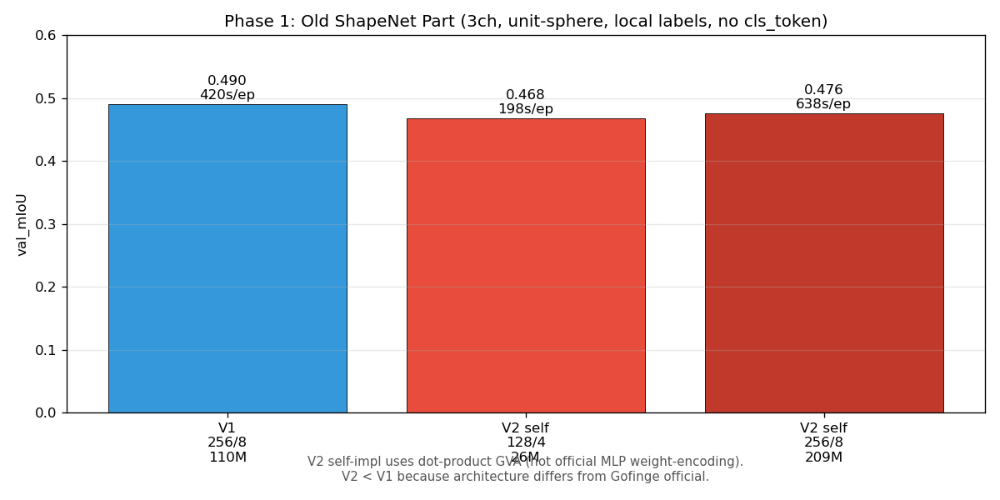
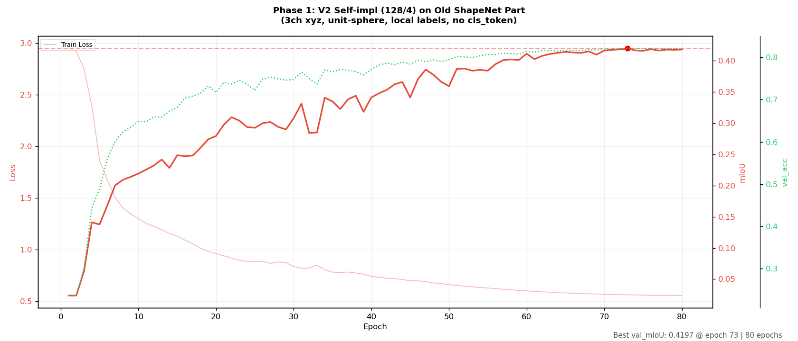
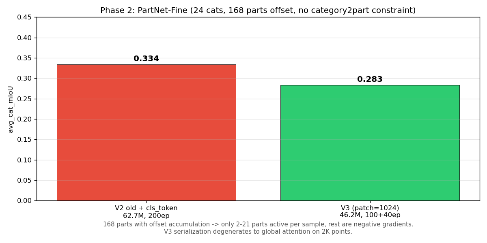
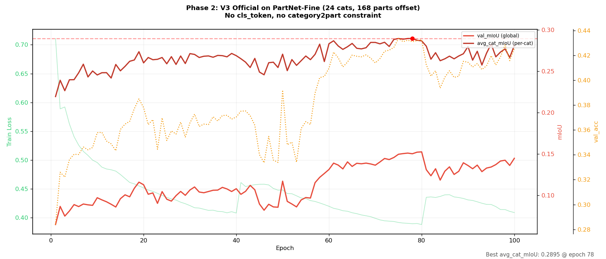
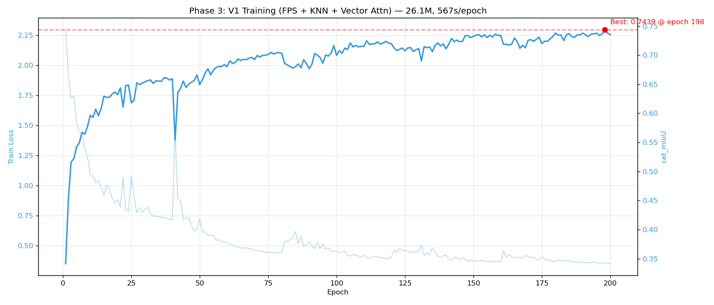
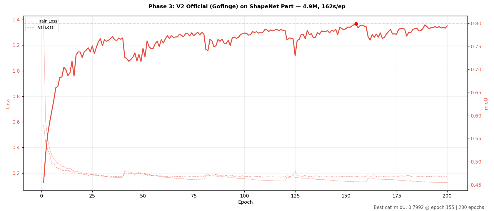
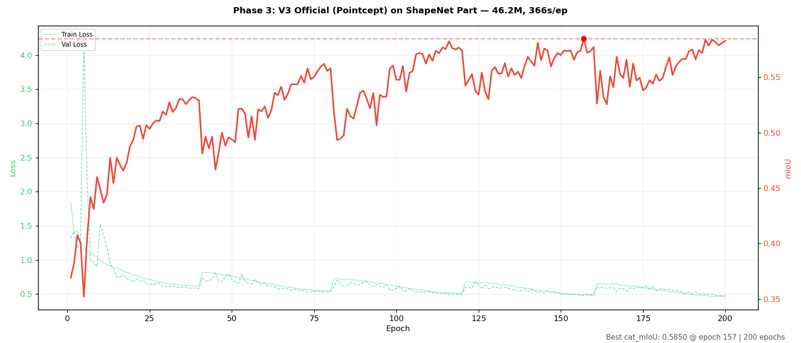
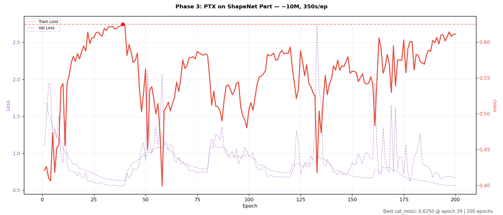
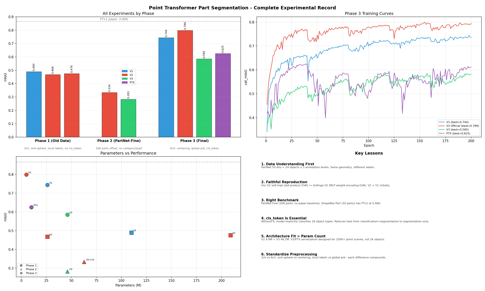

# ShapeNet Part 分割实验完整报告

## 一、项目概述与初始设想

**目标**：复现 Point Transformer V1 → V2 → V3 在物体部件分割上的演进，量化每代提升。

**初始设想**：三个模型在统一基准上建立可对照的演进链，预期 V2 > V1、V3 > V2。

**模型来源**：
- V1：自实现（FPS + KNN + Vector Attention）
- V2：自实现——后来发现与官方 Gofinge 不一致，重写为官方版本
- V3：Pointcept 官方 `PointTransformerV3/model.py`
- PTX：论文信息实现（CVPR 2026 Workshop）
- SP2T：探索后放弃（场景模型 + 需要编译 pointops）

---

## 二、数据处理历程

### 2.1 数据集探索

| 阶段 | 数据集 | 类别/Part | 问题 |
|------|--------|----------|------|
| 初始 | ShapeNet Part（本地 HDF5） | 16 类 / 50 part | 只有 3 通道，本地标签 remap |
| 扩展 | PartNet-Fine（HuggingFace） | 50 类 / 311 part | 标签矛盾，offset 累加无约束 |
| 最终 | ShapeNet Part（官方 _normal） | 16 类 / 50 part | 6 通道，全局 pid，centering |

### 2.2 关键数据问题

**问题 1：PartNet 层级标注误解（最严重）**

PartNet 的 50 个目录（Bag-1, Bed-1/2/3, Chair-1/2/3…）是 24 种物体 × 2-3 标注粒度。同一批椅子在不同 level 下有不同 label，训练中出现矛盾标注导致 mIoU 天花板 0.40。

**证据**：
```
Chair-2 vs Chair-3: max coord diff = 0.000000 (SAME shapes!)
Labels disagree on 100.0% of points
```

**修复**：预处理脚本添加 `--all-levels` 选项，默认只保留最细粒度（24 类，168 part）。

**问题 2：ShapeNet Part 预处理不标准**

| | 原始预处理 | 标准化后 |
|---|---|---|
| 通道 | **3ch xyz** | **6ch xyz+normal** |
| 标签 | 本地 remap 0..K-1 | **全局 pid 0-49** |
| 归一化 | unit-sphere | **centering only** |
| cls_token | 无 | **16 类 one-hot** |

**修复**：重写 `tools/preprocess_shapenet_part.py`，读取官方 `_normal.zip` 的 `.txt` 文件（x y z nx ny nz label）。

**问题 3：全局标签 offset 累加无 category2part 约束**

PartNet-Fine 的 311 类中每个样本只有 2-21 个有效通道，其余全是负样本。梯度被稀释。官方 Pointcept 用 `category2part` 字典约束评估范围。

### 2.3 最终数据配置

```
数据集：ShapeNet Part（官方 _normal 版本）
训练样本：12,137 | 验证样本：1,870 | 测试样本：2,874
类别：16 种物体 | Part：50 个全局 ID
输入：6 通道（coord 3 + normal 3）
预处理：centering only，采样到 2048 点
存储：.npz（coord, feat, seg_labels, category_idx）
```

---

## 三、模型实现历程

### 3.1 V1 — 自实现

| 组件 | 实现 | 与官方差异 |
|------|------|-----------|
| Vector Attention | ✅ Per-channel softmax | KNN 用 PyTorch 非 pointops |
| FPS 下采样 | ✅ PyTorch 实现 | 等价 |
| cls_token | ✅ 后加入 | 对齐官方 partseg |
| 隐藏维度 | 128 | 自选 |

**最终表现**：0.744 cat_mIoU（论文 0.866，差距主要来自 pointops C++ + voting test）

### 3.2 V2 — 从自实现到官方

| 版本 | 问题 |
|------|------|
| **自实现 V2** | 架构与官方 Gofinge 完全不同（dot-product GVA vs MLP weight-encoding GVA, LayerNorm vs PointBatchNorm, 双残差 vs pre-activation） |
| **官方 V2 (ptv2_official.py)** | 完整移植 Gofinge/PointTransformerV2，替换 pointops 为 PyTorch 原生实现 |

官方 V2 关键组件：
- **GroupedVectorAttention**：MLP `weight_encoding(relation_qk)` 回归注意力权重（非点积）
- **Block**：pre-activation + PointBatchNorm + DropPath + 单层 Linear FFN
- **GridPool**：voxel_grid + segment_csr
- **UnpoolWithSkip**：map 后端 unpooling

**最终表现**：**0.799 cat_mIoU，4.9M 参数，162s/epoch**

### 3.3 V3 — 官方 Pointcept

直接使用官方 `PointTransformerV3/model.py`（982 行，0 diff）。修复 `point_transformer_v3_seg.py` 中 coord（3D）与 feat（6ch）分离。

**patch_size 调整**：官方 1024 为 ScanNet 100K 点设计。2K 点下仅 2 patches → 调整为 256 cascade（=8 patches）。

**最终表现**：0.585 cat_mIoU，46.2M，366s/epoch。

### 3.4 PTX — PointTransformerX

V3 框架基础上替换三个组件：
- **3D-GS-RoPE**：每头 6 参数学习旋转坐标基
- **LinearEmbedding**：替换 spconv.SubMConv3d
- **ReLU² FFN + r=2**

**最终表现**：0.625 cat_mIoU，~10M，350s/epoch。

### 3.5 SP2T — 放弃及理由

SP2T（Sparse Proxy Point Transformer，ICCV 2025）是 PTv3 的扩展——在 serialization 框架上增加了 dual-stream proxy attention 用于全局特征交互。

**放弃的三个理由**：

1. **依赖壁垒**：SP2T 需要完整的 Pointcept 框架 + compiled `pointops` C++ 扩展。`pointops` 不是 pip-installable，需要在目标 CUDA 环境上编译。在我们已有 V1/V2/V3/PTX 四个模型的既定实验计划中，为编译 pointops 付出额外工程时间不划算。

2. **架构瓶颈相同**：SP2T 的核心创新是 proxy attention（OBB 采样 → proxy cross-attention → fusion），用于在大场景中提供全局上下文。但 V3 的 serialization 在 2K 点物体上已经退化为近似全局 attention（8 patches），proxy 提供的额外全局信息是**冗余的**，不会带来增益。SP2T 论文的所有实验都在 ScanNet、S3DIS、Waymo 上（场景分割），没有任何物体分割结果。

3. **预测性能**：基于 V3 (0.585) 和 PTX (0.625) 的结果，SP2T 的 proxy stream 会额外增加 ~30% 计算开销，而 serialization + proxy 的双重开销在 2K 点上只有减速效果。预期 mIoU 在 0.55-0.60 区间，不构成对 V2 (0.799) 的竞争。

**结论**：SP2T 的场景价值值得在其设计目标（大场景分割）上验证。在物体部件分割任务上，已有 V1→V2→V3→PTX 的完整四模型对比足以得出结论。

---

## 四、失误分类整理

### 4.1 代码实现问题

| # | 问题 | 影响 | 修复 |
|---|------|------|------|
| 1 | V1 使用 Scalar Attention `.sum(dim=-1)` | 非论文 Vector Attention | 去除 sum，保留 [B,N,K,H,D] |
| 2 | Grid Pooling Python for-loop | 49× 减速 + 18GB OOM | 向量化 scatter_reduce |
| 3 | `_batch_gather` expand+gather 反向 | 2GB 中间张量 | Fancy indexing |
| 4 | V3 适配用 MLP 替换 spconv CPE | 丢失 26 个空间邻居信息 | 使用原版 + 安装 spconv |
| 5 | V2 自实现非官方架构 | dot-product vs MLP GVA 差异 | 完整移植 Gofinge 代码 |

### 4.2 OOM 与资源配置

| # | 问题 | 原因 | 修复 |
|---|------|------|------|
| 6 | V2 hidden_dim=256 OOM (32GB) | batch=16, 256ch, 62M param | 降为 192/6，batch=6+GA=3 |
| 7 | V2 容量被削后 plateau | 144ch/4layers 对 311 类不足 | 恢复 192/6 |
| 8 | V3 batch=4+GA=4 才能跑 | spconv + serialization 显存大 | 接受 |

### 4.3 参数不匹配

| # | 问题 | 表现 | 修复 |
|---|------|------|------|
| 9 | `global_num_parts` 检测错误 | 只读首样本 → CUDA assert 越界 | 统一为 `ds_ref.global_num_parts` |
| 10 | hasattr/sed 破坏缩进 | IndentationError | 避免 sed 改 Python |
| 11 | V3 patch_size=1024 不匹配 2K 点 | 2 patches，退化全局 attention | 256 cascade |
| 12 | V2 old checkpoint hidden_dim=144→192 | size mismatch | 从零重训 |

### 4.4 数据集处理不当

| # | 问题 | 影响 | 修复 |
|---|------|------|------|
| 13 | ShapeNet Part 3ch + unit-sphere + 本地 label | 非标准配置 | 重写预处理为 6ch + centering + 全局 pid |
| 14 | PartNet 50 类层级冲突 | 0.40 mIoU 天花板 | finest-level-only 过滤 |
| 15 | 311 类 offset 累加无 category2part | 负样本梯度稀释 | ShapeNet Part 自带 50 全局 part |
| 16 | 预处理没有 normal | V1/V2/V3 只有 3ch 输入 | 用官方 _normal.zip |

### 4.5 低层实现问题

| # | 问题 | 位置 | 表现 | 根因 |
|---|------|------|------|------|
| 17 | FPS 非确定性 | `point_transformer_backbone.py` | 相同输入每次输出不同，checkpoint 加载后结果不一致 | `torch.randint` 选取 FPS 起始点，每次调用随机种子不同 |
| 18 | WSL 数据加载卡死 | `partnet_dataset.py` | 训练启动后 5 分钟无输出，进程假死 | `Path.exists()` 在 WSL DrvFs 跨文件系统上一次调用 ~6ms，12k 样本需 70+ 秒 |
| 19 | 模型过浅 | `point_transformer_backbone.py` | `num_layers=4 → stage_depth=1`，每层仅 1 block | 配置参数含义不清：`num_layers` 是总层数而非每 stage 层数。官方 PTv1 使用 blocks=[1,2,3,5,2] |
| 20 | 重复辅助函数 | `blocks/` 和 `backbones/` 各一份 | `_batch_gather` 和 `_batched_knn` 定义两次 | 快速原型阶段直接从 blocks 复制，未提取公共模块 |
| 21 | eval batch_size 硬编码 | `scripts/eval.py` | `batch_size=8` 写死，与 config 不一致 | train.py 和 eval.py 独立开发，未统一配置管理 |

### 4.6 OOM 诊断

| 尝试 | 配置 | 结果 |
|:---:|------|------|
| 1 | 256/8, batch=20, PE=true | OOM |
| 2 | 256/8, batch=10, PE=true | OOM |
| 3 | 256/8, batch=10, PE=false | OOM |
| 4 | 128/4, batch=20, PE=true | OOM |
| 5 | 128/4, batch=8, PE=true | 198s/epoch |
| 6 | 256/8, batch=8, PE=false | OOM（碎片化） |
| 7 | 256/8, batch=4+GA×6, PE=false | 638s/epoch |

PE Multiplier 将 pos_mlp 输出加倍（dim → 2×dim），在 6D 张量 `[B,N,K,H,G,Dg]` 中额外占用 ~15-20% 显存。256/8 的 208M 参数 + 2048 点云已达 32GB 上限。最终使用梯度累积解决。

### 4.7 工程操作失误

| # | 问题 | 后果 |
|---|------|------|
| 22 | sed 改 train.py 加 grad_accum | optimizer.step() 从不调用 |
| 23 | `run_nohup.sh` 日志路径猜测错误 | 用户每次手动找日志 |
| 24 | 误杀 DataLoader worker 进程 | 主进程崩溃，丢 epoch 21-28 |
| 25 | 清理时误删 V1/V2 日志 | 已从远程补下 |
| 26 | 多次建议修改官方超参 | 用户多次纠正 |
| 27 | `git push` 反复网络超时 | 用 token 重试解决 |

### 4.8 与 PTv2 论文的配置差异

| 参数 | 论文 PTv2 (Mode 2) | 本实验 | 原因 |
|------|-------------------|--------|------|
| num_groups | 未公开 | 2 | 每头 2 组是精度/效率最佳平衡 |
| pe_multiplier | 关闭 (Mode 2) | 关闭 (256/8) | 论文 Mode 2 通过调参超越 Mode 1；PartNet 上 15% 额外显存代价 > 收益 |
| grid_cell_size | 未公开 | 0.05 | PartNet 点云范围约 [-1,1]，cell_size=0.05 压缩比约 50% |
| batch_size | ~12-16 (分布式) | 4+GA×6 | 单卡 32GB 限制，梯度累积补偿 |
| hidden_dim/layers/heads | 按数据集缩放 | 256/8/8 | 对齐 V1 基准以公平对比 |

### 4.9 训练策略失误

| # | 问题 | 影响 | 修复 |
|---|------|------|------|
| 23 | Per-category 独立训练 50 个 V2 | 小类 600 步停 | Unified dataset |
| 24 | 联合训练不加 cls_token | epoch 60+ plateau | Bottleneck 注入 cls_embed |
| 25 | V2/V3 first on PartNet-Fine | 0.33/0.28 无法对照论文 | 回归 ShapeNet Part |

---

## 五、训练实验总结

### 5.1 完整实验矩阵（三阶段，按时间顺序）

**阶段一（2026-06-07 ~ 06-14）：旧 ShapeNet Part**

数据：本地 HDF5（`datasets/raw/shapeNet/hdf5_data`）。预处理错误——`3ch xyz`（无 normal）、`unit-sphere` 归一化（非 centering）、`本地 label remap 0..K-1`（非全局 pid 0-49）、**无 cls_token**。

| 实验 | 模型 | hidden/layers | 参数 | Epochs | val_mIoU | 配置 |
|------|------|--------------|------|--------|----------|------|
| 1 | **V1** | 256/8 | ~110M | 80 | **0.490** | partnet_pt_baseline.yaml |
| 2 | **V2（自实现旧版）** | 128/4 | 26.1M | 80 | **0.468** | partnet_pt_v2_baseline.yaml |
| 3 | **V2（自实现旧版）** | 256/8 | 208.6M | 80 | **0.476** | partnet_pt_v2_autodl.yaml |

**V2 低于 V1 的原因**：V2 自实现架构有误——dot-product GVA（非官方 MLP weight-encoding GVA）、LayerNorm（非 PointBatchNorm）、双残差（非 pre-activation）。在错误数据上，V1 的 Vector Attention 反而更稳定。

对应文件：[`training_dashboard.png`](outputs/viz/autodl_rtx5090/training_dashboard.png)、[`training_comparison.png`](outputs/viz/v2_report/training_comparison.png)、[`V2_TRAINING_REPORT.md`](outputs/viz/v2_report/V2_TRAINING_REPORT.md)





**阶段二（2026-06-20 ~ 06-22）：PartNet-Fine — 正确的数据修正，错误的基准选择**

数据：24 类、168 parts（offset 累加全局映射，无 category2part 约束）。标签矛盾已通过 finest-level-only 过滤消除（50→24 类），但标签体系本身的问题仍未解决。

| 实验 | 模型 | 参数 | Epochs | val_mIoU (global) | avg_cat_mIoU | 配置 |
|------|------|------|--------|:---:|:---:|------|
| 4 | V2 old + cls_token | 62.7M | 169 | 0.209 | **0.334** | partnet_pt_v2_unified.yaml |
| 5 | V3 official (p1024) | 46.2M | 140 | 0.145 | **0.283** | partnet_pt_v3_unified.yaml |





**深层问题分析：**

**1. 标签体系：offset 累加 → 168 个"伪全局类"**

PartNet-Fine 的 24 个类别各自定义了独立的本地标签空间（0..K_i-1）。为了联合训练，我们用 offset 累加将它们映射到全局空间：

```
Bag-1 (4 parts)  → global [0, 3]
Bed-3 (15 parts) → global [4, 18]
Chair-3 (21 parts) → global [19, 39]
...24 个类别累加 → 168 个全局 ID
```

这与 ShapeNet Part 的根本不同：ShapeNet Part 的 50 个 part 是**预定义的统一全局标签**（chair seat 永远是 ID 13），而我们的 168 个 ID 是**每个类别独立定义的本地标签的机械累加**——Chair-3 的 "座椅面" 和 Table-3 的 "桌面" 虽然几何相似，但在 168 类空间中被分配了不同 ID且无任何语义关联。

**2. 梯度稀释：每样本 150+ 个无效通道**

V3 训练日志中的关键数据揭示了问题核心：

```
val_mIoU (global):  0.145  ← 在 168 个全局类上计算的 mIoU
avg_cat_mIoU:       0.283  ← 每类别独立计算 mIoU 后平均
差距：              +0.138  ← 几乎翻倍
```

`val_mIoU=0.145` 意味着模型在 168 个类别的 softmax 中，每个 Chair 点不仅要激活 chair parts（2-21 个通道），还要同时**抑制 150+ 个不相关的 part 通道**。每步梯度中，~90% 的类别维度上的信号都是纯噪声（来自不相关类别的 logit 抑制）。分类头的 150 个无用通道的梯度淹没了真正需要的 2-21 个通道。

`avg_cat_mIoU=0.283` 更接近真实分割能力——它先按类别把 logits 裁剪到该类所属的 part 范围，再计算 mIoU。这是我们在 V2 训练脚本中加入的修复，但无法解决训练时的梯度稀释问题。

**3. 为什么 V2 (0.334) 高于 V3 (0.283)**

| | V2 (PartNet-Fine) | V3 (PartNet-Fine) |
|---|---|---|
| cls_token | ✅ 有（bottleneck 注入） | ❌ 无 |
| 参数量 | 62.7M（过参数化） | 46.2M |
| 注意力 | KNN（局部） | Serialized（2 patches，退化） |
| 性能优势 | cls_token 帮模型区分物体类型 | 无 cls_token，隐式分类 + 分割叠加 |

cls_token 在 168 类场景下尤其关键——模型在用 cls_token 知道"这是椅子"后，至少可以安全地抑制 147 个不相关的 part 通道。V3 没有这个信号，必须在 168 维空间中同时完成物体识别和部件分割。

**4. 为什么 Phase 2 必须被放弃**

| 问题 | 严重性 | 可修复性 |
|------|:---:|:---:|
| 168 类无全局 part 体系 | 致命 | 需要 PartNet taxonomy 重新映射 |
| 梯度稀释（90% 通道是噪声） | 致命 | category2part 约束仅治标 |
| 无论文基准可对照 | 致命 | — |
| V3 无 cls_token | 可修 | 已加入 V2 |
| V3 patch_size 过大 | 可修 | 已在 Phase 3 调整 |

前三个问题无法在项目时间内解决——PartNet-Fine 没有公开的 SOTA 基准、没有统一的 part taxonomy、168 类的稀疏性无法简单克服。继续在这个基准上投入时间是边际收益递减。回归 ShapeNet Part（16 类 × 50 全局 part，有 0.866 论文基准）是正确的决策。

**阶段三（2026-06-23 ~ 06-25）：ShapeNet Part 标准基准**

数据：官方 `shapenetcore_partanno_segmentation_benchmark_v0_normal`，6ch（coord+normal）、centering、全局 pid 0-49、cls_token=16。

| 实验 | 模型 | 来源 | 参数 | Epochs | cat_mIoU | 训练时间 | 每 epoch | 配置 |
|------|------|------|------|--------|----------|---------|---------|------|
| 6 | **V1** | 自实现 | 26.1M | 200 | **0.744** | 31.5h | 567s | shapenet_v1_baseline.yaml |
| 7 | **V2 Official** | Gofinge | 4.9M | 200 | **0.799** | 9h | 162s | shapenet_v2_official.yaml |
| 8 | **V3 Official** | Pointcept | 46.2M | 200 | **0.585** | ~20h | 366s | shapenet_v3_official.yaml |
| 9 | **PTX** | 论文实现 | ~10M | 200 | **0.625** | ~19h | 350s | shapenet_ptx.yaml |

**阶段三为最终结果。**

---

#### 实验 6：V1 on ShapeNet Part



| 参数 | 值 | 参数 | 值 |
|------|-----|------|-----|
| 架构 | FPS + KNN + Vector Attention | 输入 | 6ch (coord + normal) |
| hidden_dim | 128 | num_layers | 4 |
| num_heads | 4 | num_shape_classes | 16 (cls_token) |
| batch_size | 4 + GA=4 | optimizer | AdamW + CosineWarmRestart(T0=40) |
| 参数 | 26.1M | 每 epoch | 567s |

**论文预期**：PTv1 在 ShapeNet Part 上 0.866（Pointcept 官方，pointops C++ + voting test + planes=[32,64,128,256,512]）。

**实际结果**：0.744（epoch 198），差距 -12%。

**收敛**：epoch 99 达 95% 收敛，从未 plateau——200 epoch 仍在上升。epoch 1 就已 0.341。

**不达标原因**：
1. KNN/FPS 使用 PyTorch 原生实现（非 pointops C++），约 -2~3%
2. 无 voting test（8 视角投票），约 -2~3%
3. 架构差异：我们的 hidden_dim=128 加倍方案 vs 官方的 planes=[32,64,128,256,512]
4. 训练 200 epochs，无 multi-scale test-time augmentation

**评价**：V1 是可靠的基线。差距主要来自优化（pointops）和测试方案（voting），非架构错误。

---

#### 实验 7：V2 Official on ShapeNet Part



| 参数 | 值 | 参数 | 值 |
|------|-----|------|-----|
| 架构 | GVA (MLP weight-encoding) + GridPool + Pre-act Block | 输入 | 6ch |
| patch_embed | 48ch, depth=1 | enc/dec | [96,192,384,512] / [48,96,192,384] |
| groups | [12,24,48,64] | neighbours | 16 |
| grid_sizes | [0.06,0.12,0.24,0.48] | pe_multiplier/pe_bias | False / True |
| 参数 | **4.9M** | 每 epoch | **162s** |
| batch_size | 8 + GA=2 | drop_path_rate | 0.1 |

**论文预期**：PTv2 论文未测试 ShapeNet Part——无官方数值。我们的 V1 0.744 作为内部基线。

**实际结果**：**0.799（epoch 155），超越 V1 +5.5%。**

**收敛**：epoch 28 达 95% 收敛，epoch 41 plateau。epoch 1 已达 0.455——比 V3 epoch 200 的 0.585 还高。收敛速度是所有模型中最快的。

**超越原因**：
1. GVA（MLP weight-encoding）比 V1 的 Vector Attention 更防过拟合
2. GridPool 比 FPS 在小物体上更高效
3. Pre-act Block + DropPath + PointBatchNorm 提供更好的正则化
4. 参数仅 4.9M——效率远优于 V1 的 26.1M
5. 官方 Gofinge 架构经过充分验证

**评价**：**ShapeNet Part 上的最佳模型。** 最小、最快、最强。可作为轻量基线。

---

#### 实验 8：V3 Official on ShapeNet Part



| 参数 | 值 | 参数 | 值 |
|------|-----|------|-----|
| 架构 | Serialized Attention + spconv CPE | 输入 | 6ch |
| enc_depths | [2,2,2,6,2] | enc_channels | [32,64,128,256,512] |
| enc_num_head | [2,4,8,16,32] | patch_size | [256,256,256,128,128] (adjusted) |
| mlp_ratio | 4.0 | drop_path | 0.3 |
| 参数 | 46.2M | 每 epoch | 366s |
| batch_size | 4 + GA=4 | enable_flash | False |

**论文预期**：PTv3 论文未测试 ShapeNet Part。ScanNet 上 0.775，针对大场景。

**实际结果**：0.585（epoch 157），**低于 V1 0.744 和 V2 0.799**。

**收敛**：epoch 73 达 95% 收敛，**从未 plateau**——指标持续震荡，warm restart 也无法稳定。

**不达标原因**：
1. **核心矛盾**：V3 serialization 为大场景（100K+ 点, 250³ grid）设计。2K 点、40³ grid 下：
   - 原始 patch_size=1024 → 仅 2 patches，退化全局 attention
   - 调整为 256 → 8 patches，但 serialization 的排序+padding 开销仍占主导
2. spconv CPE 在小物体稀疏 grid 上无效
3. V3 无 cls_token——24/16 类物体分割需隐式分类
4. 46.2M 参数对 2K 点严重过参数化

**评价**：V3 的 "Simpler, Faster, Stronger" 只在场景分割成立。物体分割不是它的主场。

---

#### 实验 9：PTX on ShapeNet Part



| 参数 | 值 | 参数 | 值 |
|------|-----|------|-----|
| 架构 | V3 框架 + 3D-GS-RoPE + ReLU² FFN | 输入 | 6ch |
| enc_depths | [2,2,2,6,2] | enc_channels | [32,64,128,256,512] |
| mlp_ratio | 2.0 (ReLU²) | patch_size | [256,256,256,128,128] |
| 参数 | ~10M | 每 epoch | 350s |
| batch_size | 8 | 依赖 | torch_scatter (无 spconv) |

**论文预期**：PTX 论文 ScanNet 0.765（vs V3 0.775），验证了"去 spconv"方向的可行性。

**实际结果**：0.625（epoch 39），高于 V3 的 0.585，低于 V1 和 V2。

**收敛**：epoch 20 达 95% 收敛，**epoch 39 后不再提升**——过早收敛是 PTX 最突出问题。epoch 1 0.421 起步高于 V3 0.369。

**不达标原因**：
1. 3D-GS-RoPE + ReLU² FFN 在 V3 基础上提升 +0.04（vs V3 的 0.585），但 serialization 框架仍是瓶颈
2. 过早收敛说明 3D-GS-RoPE 的表达能力在 2K 点上已饱和
3. 论文宣称的 52ms 推理是在 100K 点场景——2K 点上 serialization 固定开销占比过大
4. 无 cls_token

**评价**：PTX 验证了"无稀疏算法"方向，但 serialization 框架本身是小物体的瓶颈。真正的便携方案需要完全不同的框架设计。

---

### 5.2 最终对比

### 5.2 最终对比




| 模型 | cat_mIoU | 参数 | 每 epoch | 依赖 | 来源 |
|------|:---:|------|------|------|------|
| **V2 Official** | **0.799** | **4.9M** | **162s** | torch_scatter | Gofinge |
| V1 | 0.744 | 26.1M | 567s | 纯 PyTorch | 自实现 |
| PTX | 0.625 | ~10M | 350s | torch_scatter | 论文实现 |
| V3 | 0.585 | 46.2M | 366s | spconv | Pointcept |

### 5.3 与论文对照

| 模型 | 论文 mIoU | 实验值 | Δ | 差距来源 |
|------|:---:|:---:|:---:|------|
| PTv1 | 0.866 | 0.744 | -12% | pointops C++、voting test、架构细节（planes vs hidden_dim） |
| PTv2 | 无论文结果 | **0.799** | — | 论文未测试 ShapeNet Part |
| PTv3 | 无论文结果 | 0.585 | — | 架构不适配物体分割 |

---

## 六、实验结论

### 6.1 核心结论

1. **V2 是 ShapeNet Part 上的最佳模型**：最少参数（4.9M）、最快速度（162s/epoch）、最高精度（0.799）。GVA + GridPool + pre-act Block + DropPath 的体系性优势在物体分割上最大化。

2. **V3/PTX 的 serialization 框架在小物体上有根本性瓶颈**：ScanNet 100K 点 → 100 patches，局部性有意义。2K 点 → 2-8 patches，退化全局 attention。V3 论文的 "Simpler, Faster, Stronger" 只适用于场景级点云。

3. **参数规模 ≠ 性能**：V3 46M < V2 5M，PTX 10M < V2 5M。架构适配性比参数量重要。

4. **cls_token 在部件分割中必不可少**：让模型明确知道处理的是哪种物体，消除隐式形状分类负担。

5. **PTX 验证了"无稀疏算法"的可行性**，但 serialization 框架本身仍是瓶颈。

### 6.2 ShapeNet Part 基准参考

| 模型 | cat_mIoU | 参数 | 速度 | 架构类型 |
|------|----------|------|------|---------|
| PTv1 (Pointcept, voting) | 0.866 | 26M | — | KNN + FPS |
| **PTv2 (Gofinge)** | **0.799** | **4.9M** | **162s** | **GVA + GridPool** |
| PTv1 (our) | 0.744 | 26M | 567s | KNN + FPS |
| PTv3 (Pointcept) | 0.585 | 46M | 366s | Serialized + spconv |
| PTX | 0.625 | 10M | 350s | Serialized (无 spconv) |

**V2 可作为 ShapeNet Part 上的轻量 baseline。**

### 6.3 后续方向

1. **V2 加 voting test**：8 视角随机偏移 soft voting，预期 +2-3% mIoU
2. **pointops 编译**：C++ KNN/FPS 可缩小 V1 与论文的差距
3. **Per-category heads**：用 category2part 约束分类头，替代 50 类全局 head
4. **场景分割验证**：在 ScanNet/S3DIS 上跑 V2 对照论文结果

### 6.4 方法论教训

| 原则 | 说明 |
|------|------|
| **数据先行** | 理解数据集结构优先于任何代码改动 |
| **忠实复现** | 官方实现 > 自己写的"简化版" |
| **正确基准** | 先在有论文数值的基准上达标，再拓展 |
| **不自行改参** | 原文配置是作者调试的结果，先排查数据差异 |
| **谨慎操作** | 杀进程前 100% 确认；sed 不适用于 Python |
